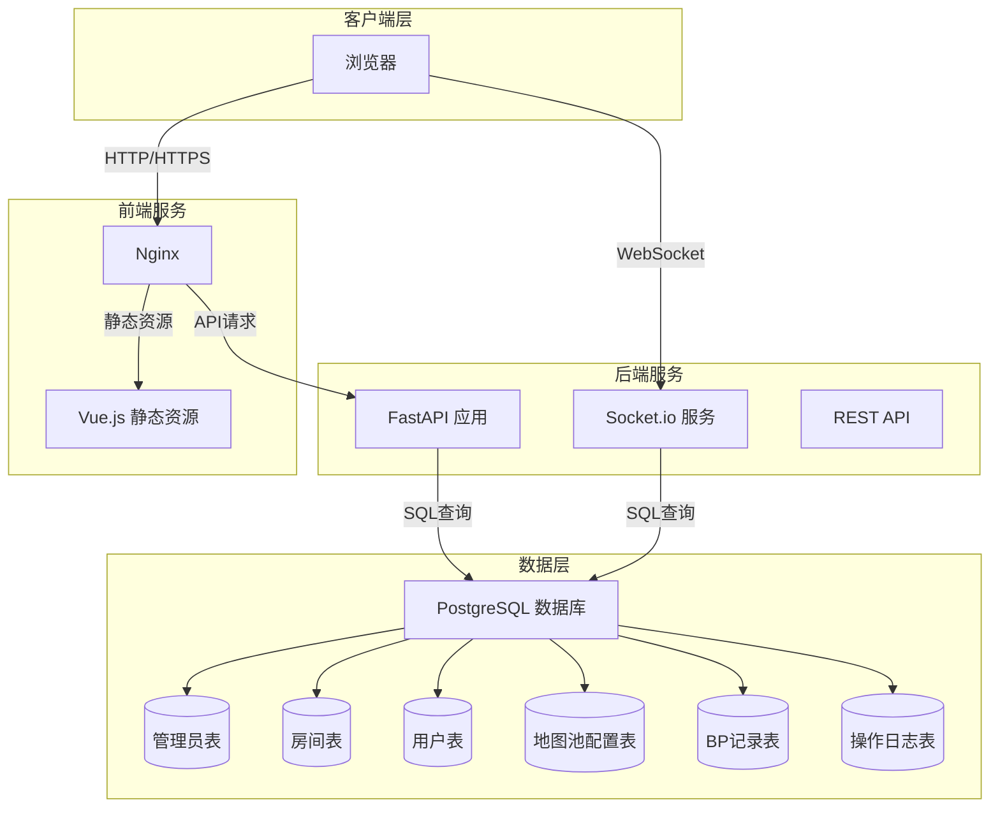
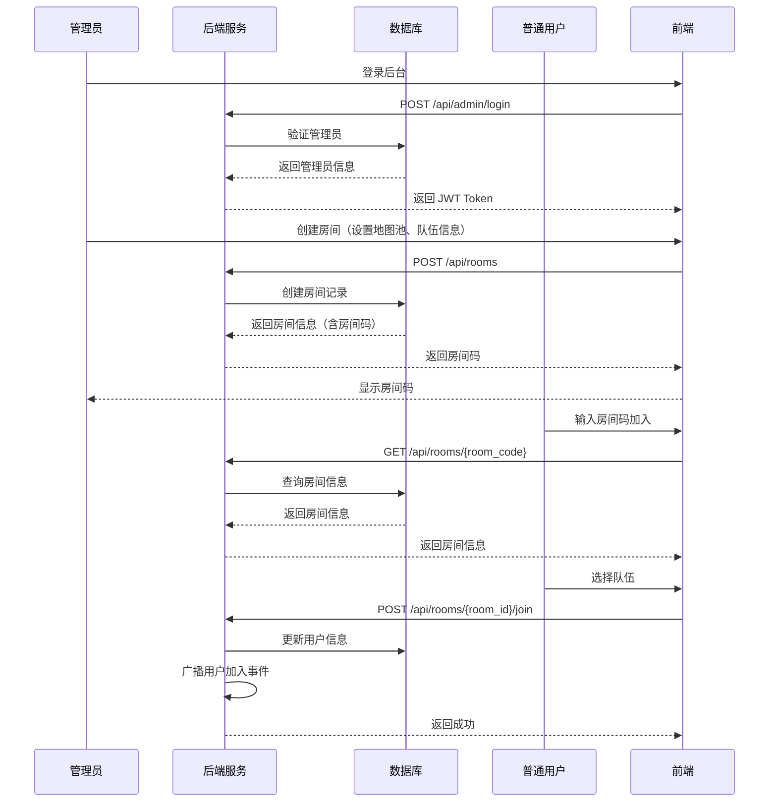
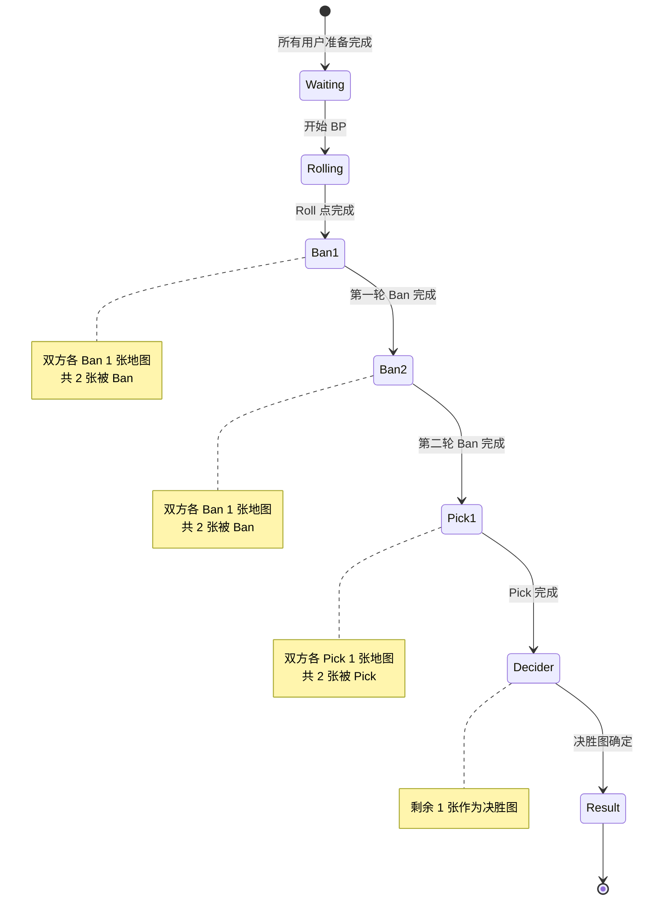
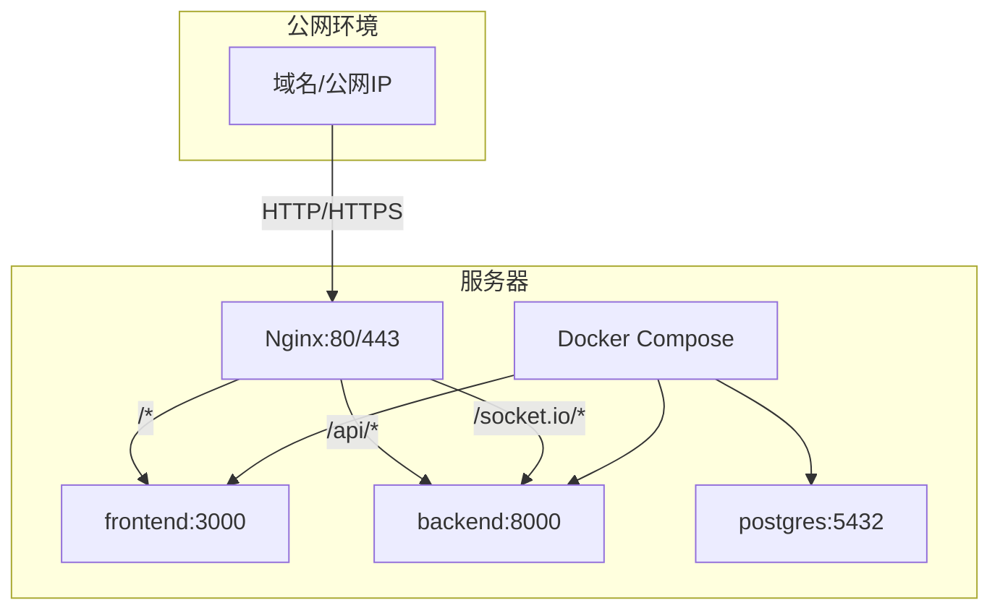

# CS2 地图 Ban Pick 工具 - 项目整体架构设计

## 1. 项目概述

本项目是一个用于 Counter-Strike 2 的地图 Ban Pick 工具，支持 BO3 模式的地图禁用和选择流程。项目需要在公网环境下运行，用户可通过浏览器直接访问。

## 2. 技术栈

| 层级 | 技术选型 | 说明 |
|------|---------|------|
| 前端 | Vue.js 3 + Vite | 现代化前端框架，支持组件化开发 |
| 前端UI | TailwindCSS | 快速构建响应式界面 |
| 前端状态管理 | Pinia | Vue 3 官方推荐的状态管理库 |
| 前端实时通信 | Socket.io-client | 与后端 WebSocket 通信 |
| 后端 | Python 3.11+ | 高性能异步 Web 框架 |
| 后端实时通信 | Socket.io | 实时双向通信 |
| 数据库 | PostgreSQL 15+ | 关系型数据库，支持复杂查询 |
| ORM | SQLAlchemy | Python ORM 框架 |
| 容器化 | Docker + Docker Compose | 便于部署和环境一致性 |
| 反向代理 | Nginx | 静态文件服务和反向代理 |

## 3. 系统架构图



## 4. 模块划分

### 4.1 前端模块

```
frontend/
├── src/
│   ├── assets/           # 静态资源（图片、图标等）
│   ├── components/       # 公共组件
│   │   ├── BPMapPolygon/      # 正七边形地图池组件
│   │   ├── ProgressBar/       # 进度条组件
│   │   ├── TeamDisplay/       # 队伍展示组件
│   │   ├── ChatBox/           # 聊天框组件
│   │   ├── Timer/             # 计时器组件
│   │   └── MapCard/           # 地图卡片组件
│   ├── views/            # 页面视图
│   │   ├── JoinRoom.vue       # 加入房间页面
│   │   ├── SelectTeam.vue     # 选择队伍页面
│   │   ├── InputName.vue      # 输入名称页面
│   │   ├── WaitingRoom.vue    # 等待准备页面
│   │   ├── BPProcess.vue      # BP流程页面
│   │   ├── BPResult.vue       # BP结果页面
│   │   └── AdminDashboard.vue # 管理员后台
│   ├── stores/           # Pinia 状态管理
│   │   ├── room.ts            # 房间状态
│   │   ├── user.ts            # 用户状态
│   │   ├── bp.ts              # BP流程状态
│   │   └── chat.ts            # 聊天状态
│   ├── services/         # API 服务
│   │   ├── api.ts             # REST API
│   │   └── socket.ts          # WebSocket
│   ├── types/            # TypeScript 类型定义
│   ├── utils/            # 工具函数
│   ├── App.vue
│   └── main.ts
├── public/
├── index.html
├── vite.config.ts
├── tailwind.config.js
└── package.json
```

### 4.2 后端模块

```
backend/
├── app/
│   ├── api/              # API 路由
│   │   ├── admin.py           # 管理员相关 API
│   │   ├── rooms.py           # 房间管理 API
│   │   ├── users.py           # 用户管理 API
│   │   ├── bp.py              # BP 流程 API
│   │   └── records.py         # BP 记录查询 API
│   ├── core/             # 核心配置
│   │   ├── config.py          # 配置文件
│   │   ├── security.py        # 安全相关（JWT、密码加密）
│   │   └── deps.py            # 依赖注入
│   ├── models/           # 数据库模型
│   │   ├── admin.py
│   │   ├── room.py
│   │   ├── user.py
│   │   ├── mappool.py
│   │   ├── bp_record.py
│   │   └── operation_log.py
│   ├── schemas/          # Pydantic 模型（请求/响应）
│   │   ├── admin.py
│   │   ├── room.py
│   │   ├── user.py
│   │   ├── bp.py
│   │   └── record.py
│   ├── services/         # 业务逻辑
│   │   ├── room_service.py
│   │   ├── bp_service.py
│   │   └── roll_service.py
│   ├── websocket/        # WebSocket 处理
│   │   ├── manager.py          # 连接管理
│   │   ├── handlers.py         # 消息处理器
│   │   └── events.py           # 事件定义
│   ├── db/               # 数据库
│   │   ├── session.py          # 数据库会话
│   │   └── base.py             # 基础模型
│   └── main.py           # 应用入口
├── tests/               # 测试
├── requirements.txt
├── Dockerfile
└── .env.example
```

## 5. 核心业务流程

### 5.1 房间创建和加入流程



### 5.2 BP 流程



## 6. WebSocket 通信设计

### 6.1 事件类型

| 事件方向 | 事件名称 | 说明 |
|---------|---------|------|
| 客户端→服务端 | `join_room` | 加入房间 |
| 客户端→服务端 | `select_team` | 选择队伍 |
| 客户端→服务端 | `update_name` | 更新用户名称 |
| 客户端→服务端 | `ready` | 用户准备 |
| 客户端→服务端 | `ban_map` | Ban 地图 |
| 客户端→服务端 | `pick_map` | Pick 地图 |
| 客户端→服务端 | `send_chat` | 发送聊天消息 |
| 服务端→客户端 | `user_joined` | 用户加入通知 |
| 服务端→客户端 | `user_left` | 用户离开通知 |
| 服务端→客户端 | `team_updated` | 队伍信息更新 |
| 服务端→客户端 | `bp_started` | BP 开始 |
| 服务端→客户端 | `bp_phase_changed` | BP 阶段变更 |
| 服务端→客户端 | `map_banned` | 地图被 Ban |
| 服务端→客户端 | `map_picked` | 地图被 Pick |
| 服务端→客户端 | `timer_tick` | 计时器更新 |
| 服务端→客户端 | `chat_message` | 聊天消息 |
| 服务端→客户端 | `bp_finished` | BP 结束 |

### 6.2 消息格式示例

```json
// 客户端发送 Ban 地图请求
{
  "event": "ban_map",
  "data": {
    "room_id": "room_123",
    "user_id": "user_456",
    "map_id": "map03"
  }
}

// 服务端广播地图被 Ban
{
  "event": "map_banned",
  "data": {
    "map_id": "map03",
    "banned_by": "TeamA",
    "user_name": "Player1",
    "timestamp": "2024-01-01T12:00:00Z"
  }
}
```

## 7. 数据一致性策略

1. **房间状态同步**：所有房间状态变更通过 WebSocket 广播给所有连接的客户端
2. **操作顺序控制**：后端维护当前操作轮次和操作人，只有当前操作人可以执行操作
3. **超时处理**：后端定时器监控操作超时，超时自动跳过
4. **最终一致性**：BP 结束后，结果写入数据库，前端展示最终状态

## 8. 安全设计

1. **管理员认证**：JWT Token 认证
2. **房间访问控制**：房间码验证，防止未授权访问
3. **操作权限验证**：验证用户是否为当前操作人
4. **输入验证**：所有用户输入进行后端验证
5. **防刷机制**：限制 API 请求频率

## 9. 性能优化

1. **静态资源缓存**：Nginx 配置缓存策略
2. **WebSocket 连接池**：复用连接，减少握手开销
3. **数据库索引**：为常用查询字段创建索引
4. **前端懒加载**：按需加载组件和路由

## 10. 部署架构



## 11. 开发环境配置

- Node.js 18+
- Python 3.11+
- Docker 20.10+
- Docker Compose 2.0+
- PostgreSQL 15+

## 12. 项目目录结构

```
CS2-Map-Ban-Pick-Tool/
├── plans/              # 架构设计文档
├── frontend/           # Vue.js 前端项目
├── backend/            # FastAPI 后端项目
├── docker-compose.yml  # Docker 编排配置
├── .gitignore
└── README.md
```
