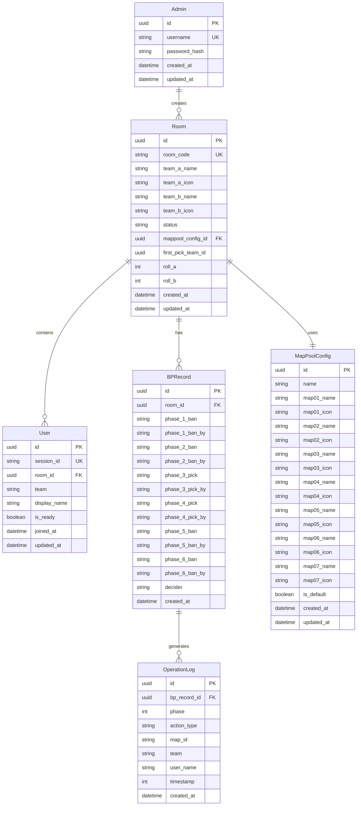

# CS2 地图 Ban Pick 工具 - 数据库模型设计

## 1. 数据库概述

本项目使用 PostgreSQL 作为数据库，采用 SQLAlchemy ORM 进行数据访问。数据库设计遵循第三范式，确保数据一致性和减少冗余。

## 2. ER 图



## 3. 表结构详解

### 3.1 管理员表 (admin)

| 字段名 | 类型 | 约束 | 说明 |
|-------|------|------|------|
| id | UUID | PK, NOT NULL | 管理员唯一标识 |
| username | VARCHAR(50) | UNIQUE, NOT NULL | 管理员用户名 |
| password_hash | VARCHAR(255) | NOT NULL | 密码哈希值（bcrypt） |
| created_at | TIMESTAMP | NOT NULL, DEFAULT NOW() | 创建时间 |
| updated_at | TIMESTAMP | NOT NULL, DEFAULT NOW() | 更新时间 |

**索引：**
- `idx_admin_username`: username

### 3.2 房间表 (room)

| 字段名 | 类型 | 约束 | 说明 |
|-------|------|------|------|
| id | UUID | PK, NOT NULL | 房间唯一标识 |
| room_code | VARCHAR(8) | UNIQUE, NOT NULL | 房间码（8位随机字符） |
| team_a_name | VARCHAR(50) | NOT NULL | 队伍A名称 |
| team_a_icon | VARCHAR(255) | NOT NULL | 队伍A图标URL |
| team_b_name | VARCHAR(50) | NOT NULL | 队伍B名称 |
| team_b_icon | VARCHAR(255) | NOT NULL | 队伍B图标URL |
| status | VARCHAR(20) | NOT NULL | 房间状态：waiting/rolling/ban1/ban2/pick1/decider/finished |
| mappool_config_id | UUID | FK, NOT NULL | 地图池配置ID |
| first_pick_team | VARCHAR(10) | NULL | 先手队伍：team_a/team_b |
| roll_a | INTEGER | NULL | 队伍A Roll点结果 |
| roll_b | INTEGER | NULL | 队伍B Roll点结果 |
| created_at | TIMESTAMP | NOT NULL, DEFAULT NOW() | 创建时间 |
| updated_at | TIMESTAMP | NOT NULL, DEFAULT NOW() | 更新时间 |

**索引：**
- `idx_room_code`: room_code
- `idx_room_status`: status

### 3.3 用户表 (user)

| 字段名 | 类型 | 约束 | 说明 |
|-------|------|------|------|
| id | UUID | PK, NOT NULL | 用户唯一标识 |
| session_id | VARCHAR(255) | UNIQUE, NOT NULL | 会话ID（浏览器存储） |
| room_id | UUID | FK, NULL | 所属房间ID |
| team | VARCHAR(10) | NULL | 所属队伍：team_a/team_b |
| display_name | VARCHAR(50) | NULL | 显示名称 |
| is_ready | BOOLEAN | NOT NULL, DEFAULT FALSE | 是否准备 |
| joined_at | TIMESTAMP | NOT NULL, DEFAULT NOW() | 加入时间 |
| updated_at | TIMESTAMP | NOT NULL, DEFAULT NOW() | 更新时间 |

**索引：**
- `idx_user_session_id`: session_id
- `idx_user_room_id`: room_id

### 3.4 地图池配置表 (mappool_config)

| 字段名 | 类型 | 约束 | 说明 |
|-------|------|------|------|
| id | UUID | PK, NOT NULL | 配置唯一标识 |
| name | VARCHAR(100) | NOT NULL | 配置名称 |
| map01_name | VARCHAR(50) | NOT NULL | 地图1名称 |
| map01_icon | VARCHAR(255) | NOT NULL | 地图1图标URL |
| map02_name | VARCHAR(50) | NOT NULL | 地图2名称 |
| map02_icon | VARCHAR(255) | NOT NULL | 地图2图标URL |
| map03_name | VARCHAR(50) | NOT NULL | 地图3名称 |
| map03_icon | VARCHAR(255) | NOT NULL | 地图3图标URL |
| map04_name | VARCHAR(50) | NOT NULL | 地图4名称 |
| map04_icon | VARCHAR(255) | NOT NULL | 地图4图标URL |
| map05_name | VARCHAR(50) | NOT NULL | 地图5名称 |
| map05_icon | VARCHAR(255) | NOT NULL | 地图5图标URL |
| map06_name | VARCHAR(50) | NOT NULL | 地图6名称 |
| map06_icon | VARCHAR(255) | NOT NULL | 地图6图标URL |
| map07_name | VARCHAR(50) | NOT NULL | 地图7名称 |
| map07_icon | VARCHAR(255) | NOT NULL | 地图7图标URL |
| is_default | BOOLEAN | NOT NULL, DEFAULT FALSE | 是否为默认配置 |
| created_at | TIMESTAMP | NOT NULL, DEFAULT NOW() | 创建时间 |
| updated_at | TIMESTAMP | NOT NULL, DEFAULT NOW() | 更新时间 |

**索引：**
- `idx_mappool_default`: is_default

### 3.5 BP记录表 (bp_record)

| 字段名 | 类型 | 约束 | 说明 |
|-------|------|------|------|
| id | UUID | PK, NOT NULL | 记录唯一标识 |
| room_id | UUID | FK, NOT NULL | 关联房间ID |
| phase_1_ban | VARCHAR(10) | NULL | 第一轮Ban的地图ID（map01~map07） |
| phase_1_ban_by | VARCHAR(10) | NULL | 第一轮Ban的队伍（team_a/team_b） |
| phase_2_ban | VARCHAR(10) | NULL | 第二轮Ban的地图ID |
| phase_2_ban_by | VARCHAR(10) | NULL | 第二轮Ban的队伍 |
| phase_3_pick | VARCHAR(10) | NULL | 第一轮Pick的地图ID |
| phase_3_pick_by | VARCHAR(10) | NULL | 第一轮Pick的队伍 |
| phase_4_pick | VARCHAR(10) | NULL | 第二轮Pick的地图ID |
| phase_4_pick_by | VARCHAR(10) | NULL | 第二轮Pick的队伍 |
| phase_5_ban | VARCHAR(10) | NULL | 第三轮Ban的地图ID |
| phase_5_ban_by | VARCHAR(10) | NULL | 第三轮Ban的队伍 |
| phase_6_ban | VARCHAR(10) | NULL | 第四轮Ban的地图ID |
| phase_6_ban_by | VARCHAR(10) | NULL | 第四轮Ban的队伍 |
| decider | VARCHAR(10) | NULL | 决胜图地图ID |
| created_at | TIMESTAMP | NOT NULL, DEFAULT NOW() | 创建时间 |

**索引：**
- `idx_bp_record_room_id`: room_id

### 3.6 操作日志表 (operation_log)

| 字段名 | 类型 | 约束 | 说明 |
|-------|------|------|------|
| id | UUID | PK, NOT NULL | 日志唯一标识 |
| bp_record_id | UUID | FK, NOT NULL | 关联BP记录ID |
| phase | INTEGER | NOT NULL | 阶段编号（1-7） |
| action_type | VARCHAR(10) | NOT NULL | 操作类型：ban/pick/decider |
| map_id | VARCHAR(10) | NULL | 地图ID（map01~map07） |
| team | VARCHAR(10) | NULL | 操作队伍 |
| user_name | VARCHAR(50) | NULL | 操作用户名称 |
| timestamp | INTEGER | NOT NULL | 时间戳（秒） |
| created_at | TIMESTAMP | NOT NULL, DEFAULT NOW() | 创建时间 |

**索引：**
- `idx_operation_log_bp_record_id`: bp_record_id
- `idx_operation_log_phase`: phase

## 4. SQLAlchemy 模型定义

### 4.1 基础模型 (base.py)

```python
from datetime import datetime
from uuid import uuid4

from sqlalchemy import DateTime
from sqlalchemy.orm import DeclarativeBase, Mapped, mapped_column


class Base(DeclarativeBase):
    pass


class TimestampMixin:
    created_at: Mapped[datetime] = mapped_column(
        DateTime, default=datetime.utcnow, nullable=False
    )
    updated_at: Mapped[datetime] = mapped_column(
        DateTime, default=datetime.utcnow, onupdate=datetime.utcnow, nullable=False
    )


class UUIDMixin:
    id: Mapped[str] = mapped_column(
        primary_key=True, default=lambda: str(uuid4()), nullable=False
    )
```

### 4.2 管理员模型 (admin.py)

```python
from sqlalchemy import String
from sqlalchemy.orm import Mapped, mapped_column

from .base import Base, TimestampMixin, UUIDMixin


class Admin(Base, UUIDMixin, TimestampMixin):
    __tablename__ = "admin"

    username: Mapped[str] = mapped_column(String(50), unique=True, nullable=False, index=True)
    password_hash: Mapped[str] = mapped_column(String(255), nullable=False)
```

### 4.3 房间模型 (room.py)

```python
from sqlalchemy import ForeignKey, Integer, String
from sqlalchemy.orm import Mapped, mapped_column

from .base import Base, TimestampMixin, UUIDMixin


class Room(Base, UUIDMixin, TimestampMixin):
    __tablename__ = "room"

    room_code: Mapped[str] = mapped_column(String(8), unique=True, nullable=False, index=True)
    team_a_name: Mapped[str] = mapped_column(String(50), nullable=False)
    team_a_icon: Mapped[str] = mapped_column(String(255), nullable=False)
    team_b_name: Mapped[str] = mapped_column(String(50), nullable=False)
    team_b_icon: Mapped[str] = mapped_column(String(255), nullable=False)
    status: Mapped[str] = mapped_column(String(20), nullable=False, index=True)
    mappool_config_id: Mapped[str] = mapped_column(
        ForeignKey("mappool_config.id"), nullable=False
    )
    first_pick_team: Mapped[str | None] = mapped_column(String(10), nullable=True)
    roll_a: Mapped[int | None] = mapped_column(Integer, nullable=True)
    roll_b: Mapped[int | None] = mapped_column(Integer, nullable=True)
```

### 4.4 用户模型 (user.py)

```python
from sqlalchemy import ForeignKey, String, Boolean
from sqlalchemy.orm import Mapped, mapped_column

from .base import Base, TimestampMixin, UUIDMixin


class User(Base, UUIDMixin, TimestampMixin):
    __tablename__ = "user"

    session_id: Mapped[str] = mapped_column(String(255), unique=True, nullable=False, index=True)
    room_id: Mapped[str | None] = mapped_column(ForeignKey("room.id"), nullable=True, index=True)
    team: Mapped[str | None] = mapped_column(String(10), nullable=True)
    display_name: Mapped[str | None] = mapped_column(String(50), nullable=True)
    is_ready: Mapped[bool] = mapped_column(Boolean, default=False, nullable=False)
    joined_at: Mapped[datetime] = mapped_column(default=datetime.utcnow, nullable=False)
```

### 4.5 地图池配置模型 (mappool.py)

```python
from sqlalchemy import String, Boolean
from sqlalchemy.orm import Mapped, mapped_column

from .base import Base, TimestampMixin, UUIDMixin


class MapPoolConfig(Base, UUIDMixin, TimestampMixin):
    __tablename__ = "mappool_config"

    name: Mapped[str] = mapped_column(String(100), nullable=False)
    map01_name: Mapped[str] = mapped_column(String(50), nullable=False)
    map01_icon: Mapped[str] = mapped_column(String(255), nullable=False)
    map02_name: Mapped[str] = mapped_column(String(50), nullable=False)
    map02_icon: Mapped[str] = mapped_column(String(255), nullable=False)
    map03_name: Mapped[str] = mapped_column(String(50), nullable=False)
    map03_icon: Mapped[str] = mapped_column(String(255), nullable=False)
    map04_name: Mapped[str] = mapped_column(String(50), nullable=False)
    map04_icon: Mapped[str] = mapped_column(String(255), nullable=False)
    map05_name: Mapped[str] = mapped_column(String(50), nullable=False)
    map05_icon: Mapped[str] = mapped_column(String(255), nullable=False)
    map06_name: Mapped[str] = mapped_column(String(50), nullable=False)
    map06_icon: Mapped[str] = mapped_column(String(255), nullable=False)
    map07_name: Mapped[str] = mapped_column(String(50), nullable=False)
    map07_icon: Mapped[str] = mapped_column(String(255), nullable=False)
    is_default: Mapped[bool] = mapped_column(Boolean, default=False, nullable=False, index=True)
```

### 4.6 BP记录模型 (bp_record.py)

```python
from sqlalchemy import ForeignKey, String
from sqlalchemy.orm import Mapped, mapped_column

from .base import Base, TimestampMixin, UUIDMixin


class BPRecord(Base, UUIDMixin, TimestampMixin):
    __tablename__ = "bp_record"

    room_id: Mapped[str] = mapped_column(ForeignKey("room.id"), nullable=False, index=True)
    phase_1_ban: Mapped[str | None] = mapped_column(String(10), nullable=True)
    phase_1_ban_by: Mapped[str | None] = mapped_column(String(10), nullable=True)
    phase_2_ban: Mapped[str | None] = mapped_column(String(10), nullable=True)
    phase_2_ban_by: Mapped[str | None] = mapped_column(String(10), nullable=True)
    phase_3_pick: Mapped[str | None] = mapped_column(String(10), nullable=True)
    phase_3_pick_by: Mapped[str | None] = mapped_column(String(10), nullable=True)
    phase_4_pick: Mapped[str | None] = mapped_column(String(10), nullable=True)
    phase_4_pick_by: Mapped[str | None] = mapped_column(String(10), nullable=True)
    phase_5_ban: Mapped[str | None] = mapped_column(String(10), nullable=True)
    phase_5_ban_by: Mapped[str | None] = mapped_column(String(10), nullable=True)
    phase_6_ban: Mapped[str | None] = mapped_column(String(10), nullable=True)
    phase_6_ban_by: Mapped[str | None] = mapped_column(String(10), nullable=True)
    decider: Mapped[str | None] = mapped_column(String(10), nullable=True)
```

### 4.7 操作日志模型 (operation_log.py)

```python
from sqlalchemy import ForeignKey, Integer, String
from sqlalchemy.orm import Mapped, mapped_column

from .base import Base, TimestampMixin, UUIDMixin


class OperationLog(Base, UUIDMixin, TimestampMixin):
    __tablename__ = "operation_log"

    bp_record_id: Mapped[str] = mapped_column(ForeignKey("bp_record.id"), nullable=False, index=True)
    phase: Mapped[int] = mapped_column(Integer, nullable=False, index=True)
    action_type: Mapped[str] = mapped_column(String(10), nullable=False)
    map_id: Mapped[str | None] = mapped_column(String(10), nullable=True)
    team: Mapped[str | None] = mapped_column(String(10), nullable=True)
    user_name: Mapped[str | None] = mapped_column(String(50), nullable=True)
    timestamp: Mapped[int] = mapped_column(Integer, nullable=False)
```

## 5. 初始化数据

### 5.1 默认管理员

| username | password |
|----------|----------|
| admin | admin123 |

### 5.2 默认地图池配置

| name | map01_name | map02_name | map03_name | map04_name | map05_name | map06_name | map07_name |
|------|-----------|-----------|-----------|-----------|-----------|-----------|-----------|
| 默认地图池 | Mirage | Inferno | Dust2 | Nuke | Anubis | Vertigo | Ancient |

## 6. 数据库迁移策略

使用 Alembic 进行数据库版本管理和迁移：

```bash
# 初始化 Alembic
alembic init alembic

# 创建迁移脚本
alembic revision --autogenerate -m "Initial migration"

# 执行迁移
alembic upgrade head
```

## 7. 数据库备份策略

1. **每日备份**：使用 pg_dump 进行全量备份
2. **备份保留**：保留最近7天的备份
3. **备份脚本**：

```bash
#!/bin/bash
DATE=$(date +%Y%m%d_%H%M%S)
pg_dump -h localhost -U postgres -d cs2_bp_tool > backup_$DATE.sql
```
